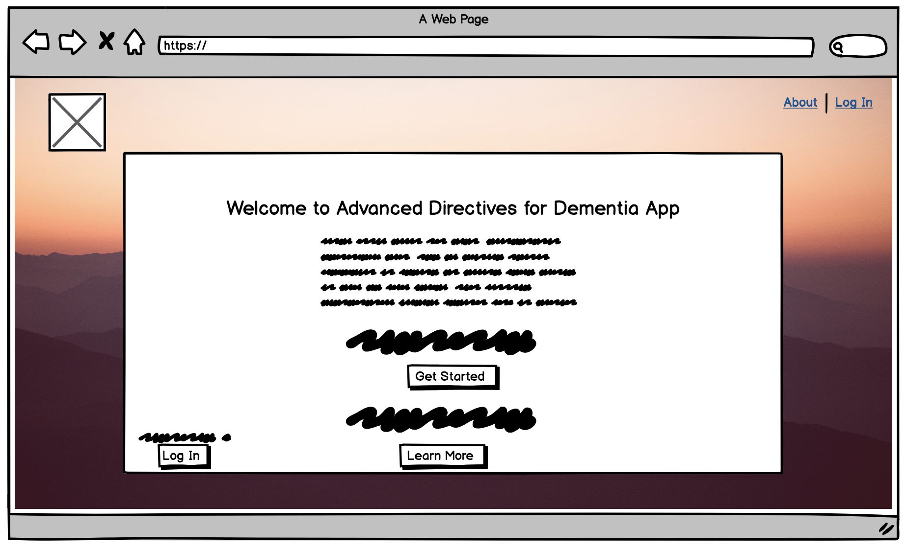
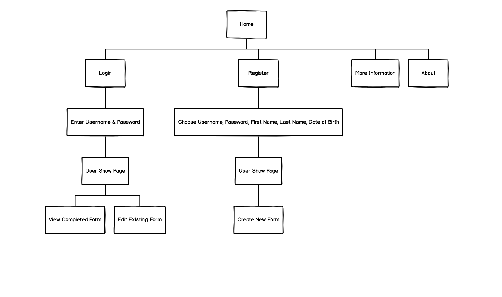
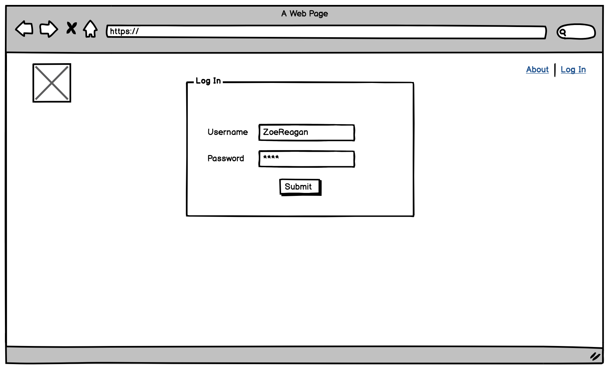
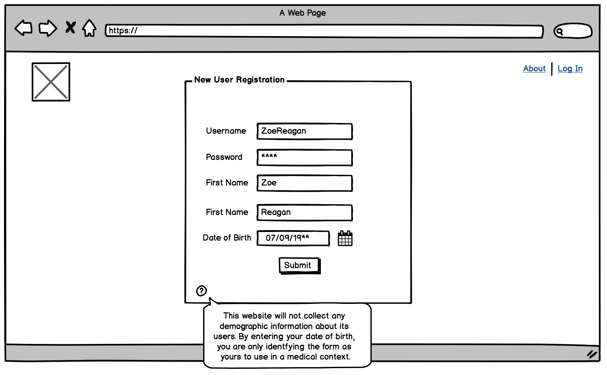
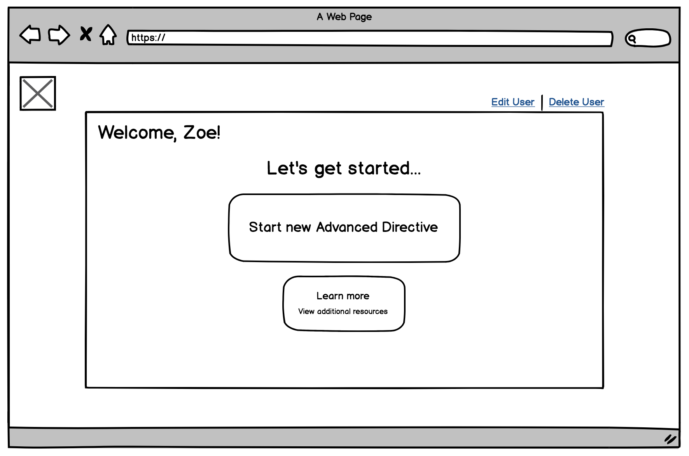
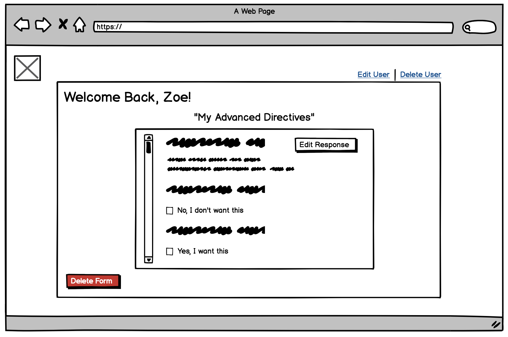
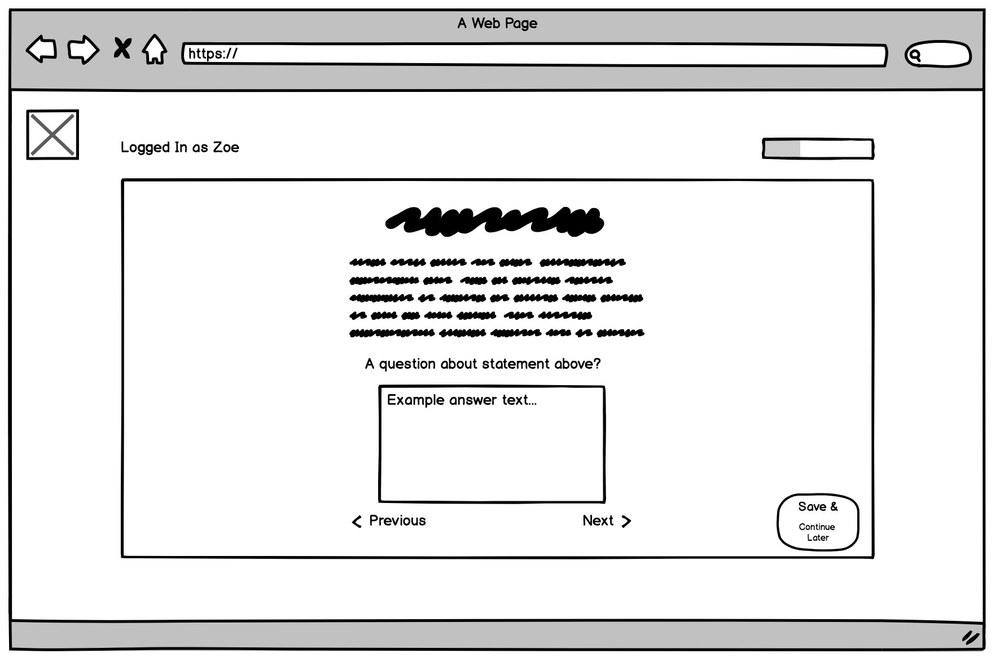

# Behest: Advanced Directives for Dementia Related Conditions

### Welcome to Behest, a planning app that helps you and your loved ones plan for your decision making in dementia related conditions.

### User Stories

##### Several applications exist for creating advanced directives but several opportunities exist for revision.  There is need for dementia related directives in an online platform.

This application uses the content of Barak Gaster, MD and his Dementia Directives created at the University of Washington.

It functions as a dementia specific living will.

###### Let's get started
User regisers or logs in.
User has ability to create new form and save to form index.
User can delete form from index.

## MVP
Create a Single Page Application with two or more data structures using React, Sinatra, ActiveRecord and PostgreSQL.

## Wireframes
Landing/Splashpage

Site Map

Log In/Register

Index Page

Questions

## Forthcoming
-Ability to update form
- Need to reformat questions so user can select check box rather than inputing text in field
- Ability to print from form index
